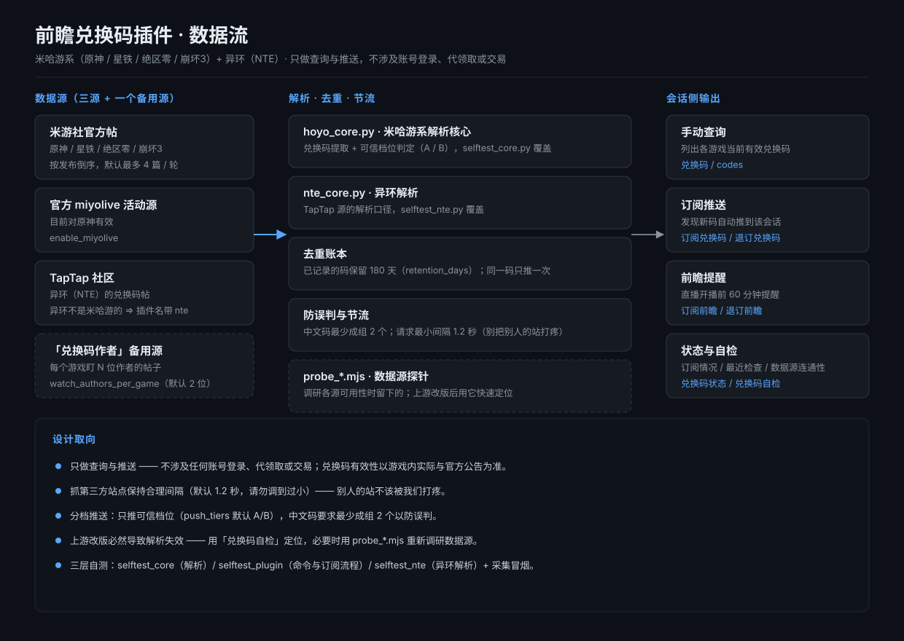
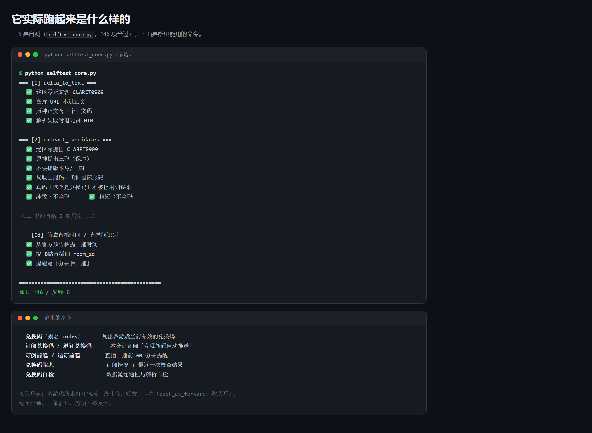

# astrbot_plugin_hoyo_nte_codes · 前瞻兑换码

> **本插件由 DeepSeek（DSH agent）编写** · 仓库由 [CNyaotian](https://github.com/CNyaotian-Lunar) 维护与发布。

AstrBot 插件：查询 **米哈游系（原神 / 崩坏：星穹铁道 / 绝区零 / 崩坏3）** 与 **异环（NTE）** 的国服前瞻直播兑换码，并在发现新码时自动推送到订阅的会话。

> 「异环」不是米哈游的游戏（走 **TapTap 社区源**），所以插件名带上了 `nte`，不只是 `hoyo`。





## 功能

- **手动查询**：`兑换码`（别名 `codes`）—— 列出各游戏当前有效的兑换码
- **订阅推送**：`订阅兑换码` / `退订兑换码` —— 发现新码时自动推到该会话
- **前瞻提醒**：`订阅前瞻` / `退订前瞻` —— 直播开播前提醒（默认提前 60 分钟）
- **状态与自检**：`兑换码状态`（订阅情况 / 最近检查）/ `兑换码自检`（数据源自检）
- **合并转发推送**：多游戏结果可打包成一条「合并转发」卡片（`push_as_forward`，默认开）

## 数据源

| 源 | 说明 |
|---|---|
| 米游社官方帖 | 原神 / 星铁 / 绝区零 / 崩坏3 的前瞻兑换码帖（按发布时间倒序取，默认最多 4 篇/轮） |
| 官方 miyolive 活动源 | `enable_miyolive`（目前对原神有效） |
| TapTap 社区 | **异环（NTE）** 的兑换码帖 |
| 「兑换码作者」备用源 | `watch_authors_per_game`（每个游戏盯 N 位作者的帖子，默认 2 位） |

> 插件目录下的 `probe_*.mjs` 是**数据源探针**（调研各源可用性与解析口径时留下的），保留下来便于上游改版后快速定位问题，日常运行不需要它们。

## 安装

把本目录整个放进 AstrBot 的插件目录，然后重载插件：

```
<AstrBot>/data/plugins/astrbot_plugin_hoyo_nte_codes/
```

或按 AstrBot 版本的插件安装方式添加本仓库。

## 命令

| 命令 | 说明 |
|---|---|
| `兑换码` / `codes` | 查询当前有效兑换码 |
| `订阅兑换码` | 本会话订阅「新码推送」 |
| `退订兑换码` | 取消订阅 |
| `订阅前瞻` | 本会话订阅「前瞻开播提醒」 |
| `退订前瞻` | 取消前瞻提醒 |
| `兑换码状态` | 查看订阅状态与最近一次检查结果 |
| `兑换码自检` | 数据源连通性与解析自检 |

## 配置

完整配置项与默认值见 `_conf_schema.json`（22 项）。几个常用的：

| 键 | 默认 | 说明 |
|---|---|---|
| `enabled_games` | `["genshin","starrail","zzz","hi3","nte"]` | 启用哪些游戏 |
| `push_tiers` | `["A","B"]` | 只推送哪些可信档位的码 |
| `push_as_forward` | `true` | 用「合并转发」推送 |
| `forward_bot_name` | `"兑换码播报"` | 合并转发卡片的昵称 |
| `check_interval_minutes` | `60` | 检查间隔 |
| `live_notice_minutes` | `60` | 提前多久提醒前瞻开播 |
| `min_cn_group` | `2` | 中文码最少成组数量（防误判） |
| `request_interval_seconds` | `1.2` | 米游社请求最小间隔（**请勿调到过小**） |
| `retention_days` | `180` | 已记录兑换码的保留天数 |

> ⚠️ 抓取第三方站点请**保持合理的请求间隔**（默认 1.2 秒），别把别人的站打疼。

## 自测

```bash
python selftest_core.py      # 解析核心（码的提取与档位判定）
python selftest_plugin.py    # 插件层（命令与订阅流程）
python selftest_nte.py       # 异环（TapTap 源）解析
python smoke_plugin_collect.py   # 冒烟：跑一轮采集
```

## 权限与依赖 / Permissions & Dependencies

**中文**

- **文件**：只读写 AstrBot 插件数据目录内的状态文件 —— 默认 `<插件目录>/data/state.json`（路径由 `__file__` 推出，不写死盘符）。写状态用「临时文件 + 原子替换」；读到坏文件时会把它改名成 `state.json.bad-<时间戳>` 留证。除插件自身目录外**不读写其他路径**，也不自行改写 AstrBot 的配置文件（配置由 AstrBot 侧传入，见 `_conf_schema.json`）。
- **网络**：运行期会向以下站点发起 HTTPS 请求以抓取**公开**的兑换码信息：`bbs-api.mihoyo.com`、`api-takumi.mihoyo.com`、`api-takumi-static.mihoyo.com`、`api.live.bilibili.com`、`www.taptap.cn`（`www.miyoushe.com` / `live.bilibili.com` 仅作为请求头 `Referer` 或展示链接出现）。合并转发卡片上的封面图取自接口返回的第三方图床 URL（域名如 `upload-bbs.miyoushe.com`），由 AstrBot 的 `Image` 组件去取。请求频率受 `request_interval_seconds`（默认 1.2 秒）限制。
- **网络开关**：**没有**一键断网的开关（插件按设计需要联网；`enable_act_id_probe`、`enable_miyolive` 等只关掉部分子路径）。离线环境下本插件不可用。
- **命令**：不调用任何外部命令、不启动子进程、不需要 root 权限。
- **凭据**：**不需要、也不读取任何账号凭据**（不做米游社 / B站 / TapTap 登录，只访问公开接口）。配置里唯一与身份相关的是合并转发卡片上显示的机器人 QQ 号（`forward_bot_uin` / `forward_bot_name`），可留空由平台自动获取。
- **依赖**：运行时依赖 AstrBot 本体（`astrbot.api`）与 `httpx`；解析逻辑只用标准库（`re` / `json` / `hashlib` / `datetime`）。
- **生命周期脚本**：无安装 / 卸载 / 升级脚本。插件只注册 AstrBot 的 `initialize` / `terminate` 钩子，并起一个后台轮询任务。
- **已知风险**：
  - 会在 **AstrBot 数据目录之内**（插件目录下）写入状态文件 `data/state.json`；升级或迁移前请自行备份该目录。备份损坏时插件会改名留证并按空状态继续，历史记录不会自动恢复。
  - 抓取的是**第三方公开站点**，其接口与页面结构随时可能改版；解析失败会以「查询失败 / 没有查到」呈现，不会伪造数据。
  - 请**不要调小** `request_interval_seconds`（默认 1.2 秒），以免给第三方站点造成压力。
  - 自动推送会把兑换码发到已订阅的会话 —— 订阅前请确认该会话合适。
  - 仓内附带的 `probe_*.mjs` / `verify_*.py` / `smoke_*.py` 是**开发期的数据源探针与验收脚本**，日常运行不需要它们；它们会直接访问第三方接口 —— 除上述运行期域名外，`probe_*.mjs` 还会访问 `hk4e-api.mihoyo.com`、`hkrpg-api.mihoyo.com`、`nap-api.mihoyo.com`、`bbs-api.miyoushe.com`、`bbs-api-os.hoyolab.com`、`m.weibo.cn`（其中 `verify_*.py` 把 `STATE_FILE` 指到系统临时目录，不碰线上状态）。

**English**

- **Files**: reads/writes only the state file inside the plugin's own data directory — by default `<plugin dir>/data/state.json` (derived from `__file__`; no hard-coded drive letters). Writes use a temp file plus atomic replace, and an unreadable state file is renamed to `state.json.bad-<timestamp>` for forensics. **No paths outside the plugin's own directory are accessed**, and the plugin does not rewrite AstrBot's config files (configuration is passed in by AstrBot; see `_conf_schema.json`).
- **Network**: at runtime it issues HTTPS requests to the following sites to fetch **public** redemption-code information: `bbs-api.mihoyo.com`, `api-takumi.mihoyo.com`, `api-takumi-static.mihoyo.com`, `api.live.bilibili.com`, `www.taptap.cn` (`www.miyoushe.com` / `live.bilibili.com` appear only as a `Referer` header or a display link). Cover images on forwarded cards come from third-party image-host URLs returned by those APIs (domain e.g. `upload-bbs.miyoushe.com`) and are fetched by AstrBot's `Image` component. Request rate is throttled by `request_interval_seconds` (default 1.2 s).
- **Network switch**: there is **no** single network kill-switch (the plugin requires networking by design; options such as `enable_act_id_probe` / `enable_miyolive` only disable individual sub-paths). The plugin is unusable offline.
- **Commands**: spawns no external commands or subprocesses and requires no root privileges.
- **Credentials**: requires and reads **no account credentials** (no Miyoushe / Bilibili / TapTap login; public endpoints only). The only identity-related settings are the bot QQ number/name shown on forwarded cards (`forward_bot_uin` / `forward_bot_name`), which may be left empty for auto-detection.
- **Dependencies**: requires AstrBot itself (`astrbot.api`) and `httpx` at runtime; parsing logic uses only the standard library (`re` / `json` / `hashlib` / `datetime`).
- **Lifecycle scripts**: none (no install/uninstall/upgrade scripts). The plugin only registers AstrBot's `initialize` / `terminate` hooks and starts one background polling task.
- **Known risks**:
  - It writes a state file **inside AstrBot's data directory** (under the plugin directory: `data/state.json`); back that directory up before upgrades or migrations. If the state file is corrupted the plugin renames it for forensics and continues from an empty state — history is not restored automatically.
  - It scrapes **third-party public sites** whose APIs and markup may change at any time; failures surface as "query failed / nothing found" rather than fabricated data.
  - Do **not** lower `request_interval_seconds` (default 1.2 s), to avoid putting load on third-party sites.
  - Automatic pushes send codes to subscribed sessions — make sure the session is appropriate before subscribing.
  - The bundled `probe_*.mjs` / `verify_*.py` / `smoke_*.py` files are **development-time data-source probes and acceptance scripts**, not needed at runtime; they hit third-party endpoints directly — besides the runtime domains listed above, `probe_*.mjs` also contacts `hk4e-api.mihoyo.com`, `hkrpg-api.mihoyo.com`, `nap-api.mihoyo.com`, `bbs-api.miyoushe.com`, `bbs-api-os.hoyolab.com` and `m.weibo.cn` (`verify_*.py` points `STATE_FILE` at the system temp dir and does not touch live state).

## 免责声明

- 本插件**只做查询与推送**，不涉及任何账号登录、代领取或交易行为。
- 兑换码来自各游戏官方公开渠道，**有效性以游戏内实际为准**；请以官方公告为最终依据。
- 第三方站点的解析口径随其改版可能失效 —— 失效时请用 `兑换码自检` 定位，或更新 `probe_*.mjs` 重新调研。

## License

MIT（见 `LICENSE`）。本插件由 DeepSeek 编写，CNyaotian 维护。
